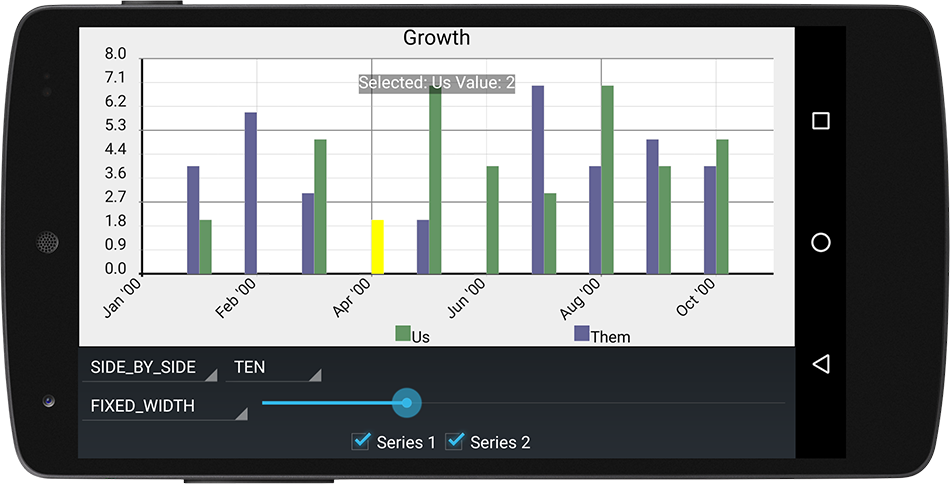

# Bar Charts
In Androidplot, Bar Charts are implemented as a special renderer that draws the points of an XYSeries as
vertical bars with the height of the vertical bar representing that point's y-val.



# Basic Usage
Rendering an XYSeries as a bar chart is as simple as adding the series to an XYPlot with an instance of BarFormatter:

```java
// create a bar formatter with a red fill color and a white outline:
BarFormatter bf = new BarFormatter(Color.RED, Color.WHITE);
plot.addSeries(series, bf);
```

# Bar Groups
A common use case of bar charts is to represent a group of two or more values for a given interval as
individual bars, for example the number of wins and losses for a baseball team for every month over the course
of a year.

To model this in Androidplot, create two instances of XYSeries; one for wins and one for losses, each
with exactly 12 elements (one for each day of the month):

```java
XYSeries wins = new SimpleXYSeries(SimpleXYSeries.ArrayFormat.Y_VALS_ONLY, "wins", 3, 4, 5, 3, 2, 3, 5, 6, 2, 1, 3, 1);
XYSeries losses = new SimpleXYSeries(SimpleXYSeries.ArrayFormat.Y_VALS_ONLY, "losses", 0, 1, 1, 0, 1, 0, 0, 0, 2, 1, 0, 1);
```

Then, we add both series to the plot with their own formatter:

```java
// draw wins bars with a green fill:
BarFormatter winsFormatter = new BarFormatter(Color.GREEN, Color.BLACK);
plot.addSeries(wins, winsFormatter);

// draw losses bars with a red fill:
BarFormatter lossesFormatter = new BarFormatter(Color.RED, Color.BLACK);
plot.addSeries(losses, lossesFormatter);
```

Androidplot  then draws pairs of wins/losses bars side-by-side for each of the 12 indexes.  Androidplot
knows to do this because BarRenderer (the renderer used to draw series associated with a BarFormatter) 
extends [GroupRenderer](grouprenderer.md).

# BarRenderer
Unlike most other renderers, much of the visual configuration of a bar chart is configured through it's BarRenderer.
BarRenderer provides methods for setting how the width of each bar should be calculated, the space between each bar
and what style of visual grouping to use.

# Grouping Styles
BarRenderer provides three grouping styles:

* **BarRenderer.Style.OVERLAID** (default) - bars in the same grouping are overlaid on each-other, the bars being
drawn in descending order of y-val.
* **BarRenderer.Style.STACKED** - bars in the same group are stacked on top of each-other.
* **BarRenderer.Style.SIDE_BY_SIDE** - bars in the same group are drawn next to one another.

# Example
See the DemoApp's [bar chart example source](../demoapp/src/main/java/com/androidplot/demos/BarPlotExampleActivity.java).