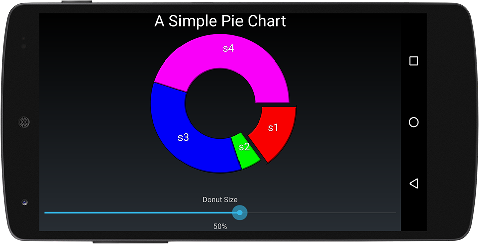

# Pie Charts
Like all other primary chart and graph classes in Androidplot, PieChart is simply a composition
of widgets along with convenience methods.  The real work is actually done by PieWidget.



# Basic Usage
Pie charts are composed of one or more values called Segments which combines a vaue and a label:

```java
Segment segment = new Segment("my segment", 10);
```

Displaying a Segment to a pie chart also requires a SegmentFormatter.  SegmentFormatter is what defines
the visual characteristics of the associated segment; color, border thickness, 
segment offset, label text style (if any) etc.  The below code instantiates a new SegmentFormatter
with a segment color of red:

```java
SegmentFormatter formatter = new SegmentFormatter(Color.RED);
```

Finally, the Segment must be added to the pie chart along with it's SegmentFormatter:

```java
pie.addSegment(segment, formatter);
```

# SegmentFormatter
As mentioned above, SegmentFormatter defines how a Segment is visually represented in a PieChart.
In addition to basic color / border line styling params, there are several parameters available
to visually distinguish a segment:

## Offset
Value in pixels used to "shift" the position of the segment relative to the center of the PieChart.
The visual effect is equivalent to cutting up a pie and dragging one piece outward, away from the rest of the pie.

## RadialInset
Value in degrees used to shrink the radial edges of the segment inward.  The visual effect is equivalent
to shaving the edges off of a slice of pie, resulting in a narrower slice of pie.

## InnerInset
Value in pixels used to shrink the inner section of the pie.  The visual effect is equivalent to
cutting the tip off of a slice of pie.

## OuterInset
Value in pixels used to shrink the outer edge of the pie.  The visual effect is equivalent to evenly
shaving the crust off of a slice of pie.

See the DemoApp's 
[pie chart example source](../demoapp/src/main/java/com/androidplot/demos/SimplePieChartActivity.java) for a comprehensive usage example.

